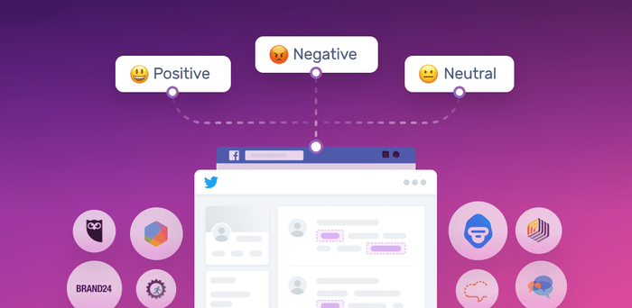

# Can Code Measure Experience? 

## Maya & Juliana

We were both very interested by machine learning and sentiment analysis - but both had a similar question: 
  Since code is created by humans, wouldn't it always, like it's creator, be biased? Is it possible to ever really understand and measure a person's individual perspective and views -- we are interested in sentiment analysis but also consider other attempted algorithms to measure and predict people.  
The project provides historical background to computational textual analysis, highlighting work done in the United States after the first World War. This history provides details into the important shift from analyzing widely produced messages as something to analyze by unit to instead including the context in which they were made and the lives of the audience who were receiving the messages. We also include examples of algorithmic bias to discuss how internal bias affect computational culture and the resulting interpretations are resulting effects of the computational designs created post World War II.  It is important to consider this of these systems: who created and now uses them, in what historical context were they used, and who benefits from them?

The project was very collaborative - both reading the others' three articles chosen in order to fully understand. We also both feel like this is just the tip of the iceberg - both our individual projects were related to sentiment and text analysis and both plan to keep studying the topic. 

